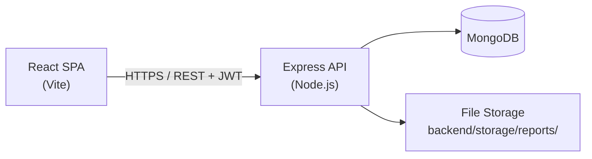

# TaxPal — Technical Project Documentation

Personal finance and tax planning application for tracking income, expenses, budgets, tax estimates, recurring transactions, and exportable financial reports.

| | |
|---|---|
| **Type** | Full-stack monorepo (React SPA + REST API) |
| **Backend** | `http://localhost:5000` |
| **Frontend** | `http://localhost:5173` |
| **Database** | MongoDB (Mongoose ODM) |
| **License** | MIT — see [LICENSE.md](./LICENSE.md) |

---

## Table of Contents

1. [Overview](#overview)
2. [Architecture](#architecture)
3. [Technology Stack](#technology-stack)
4. [Repository Structure](#repository-structure)
5. [Prerequisites](#prerequisites)
6. [Environment Configuration](#environment-configuration)
7. [Local Development](#local-development)
8. [Data Models](#data-models)
9. [API Reference](#api-reference)
10. [Frontend Application](#frontend-application)
11. [Authentication & Authorization](#authentication--authorization)
12. [Security](#security)
13. [Testing](#testing)
14. [Build & Deployment](#build--deployment)
15. [Feature Matrix](#feature-matrix)
16. [Known Limitations](#known-limitations)

---

## Overview

TaxPal helps individuals manage day-to-day finances and plan for tax obligations in one place. Users register with a country profile, receive seeded income/expense categories, log transactions, set monthly budgets, estimate quarterly taxes using country-specific slabs, schedule tax reminders, generate PDF/CSV reports, and export their full account data.

The application follows a layered backend architecture (routes → controllers → services → models) and a component-driven React frontend with shared UI primitives, global auth/toast context, and an Axios API client with JWT interceptors.

---

## Architecture

### System Context



### Backend Request Flow

```
HTTP Request
    │
    ▼
Helmet + CORS + JSON parser
    │
    ▼
Route (auth middleware on protected paths)
    │
    ▼
Controller (validation, HTTP status)
    │
    ▼
Service (business logic, aggregations)
    │
    ▼
Mongoose Model → MongoDB
    │
    ▼
Standard JSON response { success, message, data }
```

### Authentication Flow

```
Register / Login
    │
    ▼
Validate input → bcrypt hash (register) / compare (login)
    │
    ▼
Seed default categories (register) or lazy-seed (login if missing)
    │
    ▼
Issue JWT (payload: { id: userId }, expires per JWT_EXPIRES_IN)
    │
    ▼
Client stores token in localStorage
    │
    ▼
Subsequent requests: Authorization: Bearer <token>
    │
    ▼
auth.middleware → req.user.id available to controllers
```

---

## Technology Stack

### Backend

| Layer | Technology | Version |
|-------|------------|---------|
| Runtime | Node.js | 18+ |
| Framework | Express | 5.x |
| Database | MongoDB + Mongoose | 9.x |
| Auth | jsonwebtoken, bcryptjs | — |
| Security | helmet, cors, express-rate-limit | — |
| PDF generation | pdfkit | 0.18.x |
| Testing | Jest, supertest, mongodb-memory-server | — |

### Frontend

| Layer | Technology | Version |
|-------|------------|---------|
| UI library | React | 19.x |
| Build tool | Vite | 7.x |
| Styling | Tailwind CSS | 4.x |
| Routing | react-router-dom | 7.x |
| HTTP client | Axios | 1.x |
| Charts | Chart.js, react-chartjs-2, Recharts | — |
| Icons | react-icons (Feather) | — |

---

## Repository Structure

```
Taxpal-m1/
├── backend/
│   ├── src/
│   │   ├── app.js                 # Express app, middleware, route mounting
│   │   ├── server.js              # DB connect + HTTP server bootstrap
│   │   ├── config/
│   │   │   ├── db.js              # MongoDB connection
│   │   │   ├── env.js             # Environment variable loader
│   │   │   └── jwt.js             # Token generation
│   │   ├── controllers/           # Request/response handlers
│   │   ├── services/              # Business logic
│   │   ├── models/                # Mongoose schemas
│   │   ├── routes/                # Express routers
│   │   ├── middlewares/           # Auth, rate limit, error handling
│   │   ├── utils/                 # Constants, formatters, tax due dates
│   │   └── docs/
│   │       └── api-contracts.md   # Legacy API notes (superseded by this doc)
│   ├── storage/
│   │   └── reports/               # Generated PDF/CSV (private, not static-served)
│   ├── tests/                     # Jest integration tests
│   ├── .env.example
│   └── package.json
│
├── frontend/
│   ├── public/
│   │   └── manifest.json          # PWA manifest
│   ├── src/
│   │   ├── api/
│   │   │   └── apiClient.js       # Axios instance + JWT interceptors
│   │   ├── components/            # Feature + shared UI components
│   │   ├── context/               # AuthContext, ToastContext
│   │   ├── hooks/                 # useCurrency, useCategories
│   │   ├── layouts/
│   │   │   └── MainLayout.jsx     # Sidebar nav + mobile drawer
│   │   ├── pages/                 # Route-level views
│   │   ├── utils/                 # auth, config, format helpers
│   │   ├── App.jsx                # Route definitions
│   │   └── main.jsx               # React entry + providers
│   ├── .env.example
│   └── package.json
│
├── LICENSE.md
└── README.md
```

---

## Prerequisites

- **Node.js** 18 or later
- **npm** (ships with Node)
- **MongoDB** — local instance or [MongoDB Atlas](https://www.mongodb.com/atlas) cluster
- A terminal with two concurrent processes (backend + frontend dev servers)

---

## Environment Configuration

### Backend (`backend/.env`)

Copy from `backend/.env.example`:

```env
PORT=5000
MONGO_URI=mongodb://127.0.0.1:27017/taxpal
JWT_SECRET=your_strong_secret_key_here
JWT_EXPIRES_IN=7d
FRONTEND_URL=http://localhost:5173
NODE_ENV=development
```

| Variable | Required | Description |
|----------|----------|-------------|
| `MONGO_URI` | Yes | MongoDB connection string |
| `JWT_SECRET` | Yes | Secret for signing JWTs |
| `JWT_EXPIRES_IN` | No | Token TTL (default `7d`) |
| `FRONTEND_URL` | No | CORS allowed origin (default `http://localhost:5173`) |
| `PORT` | No | API port (default `5000`) |
| `NODE_ENV` | No | `development` or `production` |

### Frontend (`frontend/.env`)

```env
VITE_API_URL=http://localhost:5000/api
```

| Variable | Required | Description |
|----------|----------|-------------|
| `VITE_API_URL` | No | Backend API base URL (defaults to `http://localhost:5000/api`) |

---

## Local Development

### 1. Backend

```bash
cd backend
cp .env.example .env
# Edit .env with your MONGO_URI and JWT_SECRET
npm install
npm run dev
```

The API listens at `http://localhost:5000`. Health check: `GET /api/health`.

### 2. Frontend

```bash
cd frontend
cp .env.example .env
npm install
npm run dev
```

The app opens at `http://localhost:5173`.

### 3. Verify

1. Register a new account at `/register` (auto-login after signup).
2. Confirm default categories appear under **Categories**.
3. Add a transaction and verify the **Dashboard** summary updates.
4. Run backend tests: `cd backend && npm test`.

---

## Data Models

### User

| Field | Type | Notes |
|-------|------|-------|
| `name` | String | Required |
| `email` | String | Unique, lowercase |
| `password` | String | bcrypt hash, excluded from queries by default |
| `country` | String | Drives currency + tax slabs |
| `incomeBracket` | Enum | `low`, `middle`, `high` |
| `onboardingComplete` | Boolean | User-dismissed onboarding flag |
| `preferences.budgetAlertThreshold` | Number | Default `80` (percent) |
| `preferences.emailNotifications` | Boolean | Default `false` (not wired to email yet) |

### Transaction

| Field | Type | Notes |
|-------|------|-------|
| `user` | ObjectId | Owner reference |
| `type` | Enum | `income` \| `expense` |
| `category` | String | Must match user's category of same type |
| `amount` | Number | Min 1 |
| `date` | Date | Transaction date |
| `description` | String | Optional memo |
| `isTaxDeductible` | Boolean | Used in tax estimator when `useTrackedIncome` |
| `source` | Enum | `manual` \| `import` \| `recurring` |

**Indexes:** `{ user, date }`, `{ user, type, category }`

### Category

| Field | Type | Notes |
|-------|------|-------|
| `user` | ObjectId | Per-user categories |
| `name` | String | Unique per user + type |
| `type` | Enum | `income` \| `expense` |

**Default categories** (seeded on register): Salary, Freelance, Investments, Other Income, Food, Rent, Transport, Utilities, Entertainment, Healthcare, Shopping, Other.

### Budget

| Field | Type | Notes |
|-------|------|-------|
| `user` | ObjectId | Owner |
| `category` | String | Expense category name |
| `limit` | Number | Monthly cap |
| `month` | String | Format `YYYY-MM` |

### TaxEstimate

| Field | Type | Notes |
|-------|------|-------|
| `user` | ObjectId | Owner |
| `year` | Number | Tax year |
| `quarter` | Enum | `Q1`–`Q4` |
| `amount` | Number | Estimated quarterly tax |
| `status` | Enum | `unpaid` \| `paid` |
| `country` | String | Filing country |

**Unique index:** `{ user, year, quarter }`

### RecurringTransaction

| Field | Type | Notes |
|-------|------|-------|
| `user` | ObjectId | Owner |
| `type` | Enum | `income` \| `expense` |
| `category`, `amount`, `description` | — | Same semantics as Transaction |
| `frequency` | Enum | `weekly` \| `monthly` \| `yearly` |
| `nextDate` | Date | Next scheduled occurrence |
| `isTaxDeductible` | Boolean | Passed to generated transactions |
| `active` | Boolean | Pause/resume recurring rule |

### Report

| Field | Type | Notes |
|-------|------|-------|
| `userId` | ObjectId | Owner |
| `period` | String | e.g. `Jan 2026`, `Q1 2026` |
| `reportType` | Enum | `monthly` \| `quarterly` |
| `filePath` | String | Filename under `storage/reports/` |

Reports older than 48 hours are cleaned up automatically on new export.

---

## API Reference

**Base URL:** `/api`

**Response envelope:**

```json
{
  "success": true,
  "message": "Human-readable message",
  "data": { }
}
```

**Authentication:** Protected routes require `Authorization: Bearer <jwt>`.

### Health

| Method | Path | Auth | Description |
|--------|------|------|-------------|
| GET | `/health` | No | API liveness check |

### Auth (`/auth`)

Rate-limited: 30 requests per 15 minutes on register/login.

| Method | Path | Auth | Description |
|--------|------|------|-------------|
| POST | `/register` | No | Create account, seed categories, return token |
| POST | `/login` | No | Authenticate, lazy-seed categories if missing |
| GET | `/me` | Yes | Current user profile |
| PATCH | `/profile` | Yes | Update `name`, `country`, `incomeBracket`, `onboardingComplete` |
| PATCH | `/password` | Yes | Change password (min 8 chars) |
| DELETE | `/account` | Yes | Delete user and all associated data |
| GET | `/export` | Yes | GDPR-style JSON export of all user data |
| GET | `/onboarding` | Yes | Onboarding checklist status |

**Register body:**

```json
{
  "name": "Jane Doe",
  "email": "jane@example.com",
  "password": "securepass123",
  "country": "India",
  "incomeBracket": "middle"
}
```

**Login body:**

```json
{
  "email": "jane@example.com",
  "password": "securepass123"
}
```

### Dashboard (`/dashboard`)

| Method | Path | Auth | Query | Description |
|--------|------|------|-------|-------------|
| GET | `/summary` | Yes | `range=all\|month\|year` | Income/expense totals, balance, last 5 transactions, budget alerts |

**Summary response (`data`):**

```json
{
  "totalIncome": 50000,
  "totalExpense": 20000,
  "balance": 30000,
  "last5Transactions": [],
  "budgetAlerts": [
    { "category": "Food", "level": "warning", "percentage": 85, "message": "Food budget at 85%" }
  ],
  "range": "month"
}
```

Budget alerts fire at the user's threshold (default 80%) and at 100% (exceeded).

### Transactions (`/transactions`)

| Method | Path | Auth | Description |
|--------|------|------|-------------|
| POST | `/` | Yes | Create transaction |
| POST | `/import` | Yes | Bulk import from CSV rows |
| GET | `/` | Yes | List with filters + pagination |
| PUT | `/:id` | Yes | Update transaction |
| DELETE | `/:id` | Yes | Delete transaction |

**Create body:**

```json
{
  "type": "expense",
  "amount": 1200,
  "category": "Rent",
  "date": "2026-03-01",
  "description": "March rent",
  "isTaxDeductible": false
}
```

**List query parameters:**

| Param | Description |
|-------|-------------|
| `page` | Page number (default `1`) |
| `limit` | Page size (default `20`) |
| `type` | `income` or `expense` |
| `category` | Exact category name |
| `search` | Case-insensitive match on category or description |
| `startDate`, `endDate` | ISO date range filter |

**Import body:**

```json
{
  "rows": [
    { "type": "expense", "amount": 50, "category": "Food", "date": "2026-03-01" }
  ]
}
```

Returns `{ created: [...], errors: [{ row, message }] }`.

### Categories (`/categories`)

| Method | Path | Auth | Description |
|--------|------|------|-------------|
| POST | `/` | Yes | Create category |
| GET | `/` | Yes | List all user categories |
| PUT | `/:id` | Yes | Rename category |
| DELETE | `/:id` | Yes | Delete category |

### Budgets (`/budgets`)

| Method | Path | Auth | Description |
|--------|------|------|-------------|
| POST | `/` | Yes | Create monthly budget |
| GET | `/` | Yes | List budgets (optional `month` filter) |
| GET | `/progress` | Yes | Spent vs limit per category (`?month=YYYY-MM`) |
| PUT | `/:id` | Yes | Update budget |
| DELETE | `/:id` | Yes | Delete budget |

### Tax (`/tax`)

Supported countries for estimation: **India**, **United States**, **United Kingdom**, **Australia** (slabs in `backend/src/utils/constants.js`).

| Method | Path | Auth | Description |
|--------|------|------|-------------|
| POST | `/estimate` | Yes | Calculate yearly + quarterly tax |
| POST | `/save` | Yes | Save single quarter to calendar |
| POST | `/save-all` | Yes | Save all four quarters at once |
| GET | `/calendar` | Yes | List saved tax estimates with due dates |
| PATCH | `/calendar/:id/toggle` | Yes | Toggle paid/unpaid status |

**Estimate body (key fields):**

```json
{
  "country": "India",
  "year": 2026,
  "income": 800000,
  "businessExpenses": 50000,
  "retirement": 0,
  "insurance": 0,
  "homeOffice": 0,
  "status": "Single",
  "useTrackedIncome": true
}
```

When `useTrackedIncome` is true, income and tax-deductible expenses are pulled from logged transactions for the given year.

Filing statuses: `Single`, `Married` (10% reduction applied to taxable income), `Business` (5% surcharge on tax).

Country-specific due dates are defined in `backend/src/utils/taxDueDates.js`.

### Reports (`/reports`)

All routes require authentication. Files are stored privately and served only via authenticated download.

| Method | Path | Query | Description |
|--------|------|-------|-------------|
| GET | `/monthly` | `month=YYYY-MM` | Monthly summary |
| GET | `/quarterly` | `quarter=Q1&year=2026` | Quarterly summary |
| GET | `/tax-year` | `year=2026` | Full tax-year summary |
| GET | `/history` | — | Past generated reports |
| GET | `/export` | `type=pdf\|csv&period=...&reportType=...` | Generate and persist report |
| GET | `/download/:reportId` | — | Stream PDF/CSV file |

PDF and CSV exports use the user's country for currency formatting.

### Recurring (`/recurring`)

| Method | Path | Auth | Description |
|--------|------|------|-------------|
| POST | `/` | Yes | Create recurring rule |
| GET | `/` | Yes | List all recurring rules |
| PUT | `/:id` | Yes | Update rule |
| DELETE | `/:id` | Yes | Delete rule |
| POST | `/process` | Yes | Process all due recurring items (creates transactions) |

---

## Frontend Application

### Routes

| Path | Access | Page | Purpose |
|------|--------|------|---------|
| `/` | Public | — | Redirects to `/login` |
| `/login` | Public | Login | Sign in (redirects if token exists) |
| `/register` | Public | Register | Sign up + auto-login |
| `/privacy` | Public | Privacy | Privacy policy |
| `/dashboard` | Protected | Dashboard | Summary cards, charts, recent tx, onboarding |
| `/transactions` | Protected | Transactions | CRUD, filters, pagination, CSV import |
| `/recurring` | Protected | Recurring | Manage recurring rules |
| `/budgets` | Protected | Budgets | Monthly budget CRUD + progress |
| `/categories` | Protected | Categories | Income/expense category management |
| `/tax-estimator` | Protected | TaxEstimator | Tax calculator + save to calendar |
| `/tax-calendar` | Protected | TaxCalendar | Quarterly due dates + paid status |
| `/reports` | Protected | Reports | Generate/download PDF & CSV |
| `/settings` | Protected | Settings | Profile, password, export, delete account |
| `*` | — | — | Redirect to dashboard or login |

**Route guards:**

- `ProtectedRoute` — requires JWT in localStorage; wraps content in `MainLayout`.
- `PublicRoute` — redirects authenticated users away from login/register.

### Key Frontend Modules

| Module | Location | Responsibility |
|--------|----------|----------------|
| API client | `src/api/apiClient.js` | Axios + JWT header + 401 redirect |
| Auth state | `src/context/AuthContext.jsx` | User session, login/register/logout |
| Toasts | `src/context/ToastContext.jsx` | Global success/error notifications |
| Currency | `src/hooks/useCurrency.js` | Country-aware formatting via `format.js` |
| Categories | `src/hooks/useCategories.js` | Fetch/cache income & expense categories |
| Shared UI | `src/components/ui/` | `PageHeader`, `EmptyState`, `ConfirmModal`, `AppFooter` |
| Layout | `src/layouts/MainLayout.jsx` | Responsive sidebar, nav, user menu, footer |

### Currency Mapping

Frontend `format.js` maps user country to locale/currency:

| Country | Currency |
|---------|----------|
| India | INR (₹) |
| United States | USD ($) |
| United Kingdom | GBP (£) |
| Australia | AUD (A$) |
| Canada | CAD (CA$) |

---

## Authentication & Authorization

1. **Registration** returns `{ user, token }`. Frontend stores the token and loads `/auth/me`.
2. **Login** returns the same shape; existing users without categories get defaults lazily seeded.
3. **JWT payload** contains `{ id: userId }`. Expiration is controlled by `JWT_EXPIRES_IN`.
4. **Ownership** — all data queries filter by `req.user.id`; cross-user access returns 404/403.
5. **401 handling** — frontend clears token and redirects to `/login`, except during login/register attempts.

---

## Security

| Control | Implementation |
|---------|----------------|
| Password hashing | bcrypt (cost factor 10) |
| Password policy | Minimum 8 characters |
| HTTP headers | Helmet |
| CORS | Restricted to `FRONTEND_URL` |
| Rate limiting | Auth routes: 30 req / 15 min |
| Report files | Stored in `backend/storage/reports/`, not publicly served |
| Report download | Requires JWT + ownership check on `reportId` |
| Request body limit | 1 MB JSON |
| Secrets | `JWT_SECRET`, `MONGO_URI` in `.env` (never commit `.env`) |

---

## Testing

Backend integration tests use **Jest** + **supertest** with an in-memory MongoDB instance.

```bash
cd backend
npm test
```

| Suite | File | Coverage |
|-------|------|----------|
| Auth | `tests/auth.test.js` | Register, login, `/me`, invalid credentials |
| Transactions | `tests/transaction.test.js` | CRUD, category validation, pagination |

```bash
npm run test:watch   # Watch mode
```

---

## Build & Deployment

### Frontend production build

```bash
cd frontend
npm run build      # Output: frontend/dist/
npm run preview    # Local preview of production build
```

Set `VITE_API_URL` to your production API URL before building.

### Backend production

```bash
cd backend
NODE_ENV=production npm start
```

**Production checklist:**

- [ ] Set strong `JWT_SECRET`
- [ ] Use MongoDB Atlas or managed MongoDB with TLS
- [ ] Set `FRONTEND_URL` to production frontend origin
- [ ] Serve frontend static files via CDN/nginx; proxy `/api` to Node
- [ ] Ensure `backend/storage/reports/` is writable and backed up if needed
- [ ] Run behind HTTPS (reverse proxy)
- [ ] Do not expose MongoDB or report storage paths publicly

---

## Feature Matrix

### Core MVP

| Feature | Status |
|---------|--------|
| User registration & login with JWT | Done |
| Default category seeding on signup | Done |
| Auto-login after registration | Done |
| Dashboard summary (all/month/year ranges) | Done |
| Income & expense transactions (CRUD) | Done |
| Transaction search, filters, pagination | Done |
| CSV transaction import | Done |
| Custom categories | Done |
| Monthly budgets with progress tracking | Done |
| Budget alerts on dashboard (80% / 100%) | Done |
| Tax estimator (4 countries) | Done |
| Tracked income + tax-deductible expenses | Done |
| Tax calendar with country due dates | Done |
| Save estimates to calendar (single / all quarters) | Done |
| Monthly, quarterly, tax-year reports | Done |
| PDF & CSV export with currency formatting | Done |
| Authenticated report downloads | Done |
| Recurring transactions + process due | Done |
| Onboarding checklist banner | Done |
| Settings (profile, password, export, delete) | Done |
| Privacy policy page + footer link | Done |
| Mobile-responsive sidebar navigation | Done |
| PWA manifest | Done |
| Health check endpoint | Done |
| Backend test suite | Done |

### Not Implemented (requires external services)

| Feature | Reason |
|---------|--------|
| Bank linking (Plaid, etc.) | Third-party API integration |
| Email notifications | SMTP/transactional email provider |
| Password reset flow | Email service required |
| Two-factor authentication | Additional auth provider |
| OCR document vault | File storage + ML service |
| Real-time push notifications | WebSocket / push infrastructure |

---

## Known Limitations

- **Tax calculations are estimates only** — not professional tax advice. Slabs are simplified and may not reflect current law or individual circumstances.
- **Email notifications** preference exists on the user model but is not connected to a mailer.
- **Recurring processing** is manual via `POST /recurring/process` (no background cron job).
- **Report retention** — generated files expire after 48 hours.
- **PWA icons** — `manifest.json` ships with an empty `icons` array; add icons for install prompts.
- **Single currency per user** — derived from profile country, not per-transaction.

---

## Additional Documentation

- Legacy API flow notes: [`backend/src/docs/api-contracts.md`](backend/src/docs/api-contracts.md)
- License: [`LICENSE.md`](LICENSE.md)

---

## Quick Reference Commands

```bash
# Backend dev server
cd backend && npm run dev

# Frontend dev server
cd frontend && npm run dev

# Run tests
cd backend && npm test

# Production backend
cd backend && npm start

# Production frontend build
cd frontend && npm run build
```
